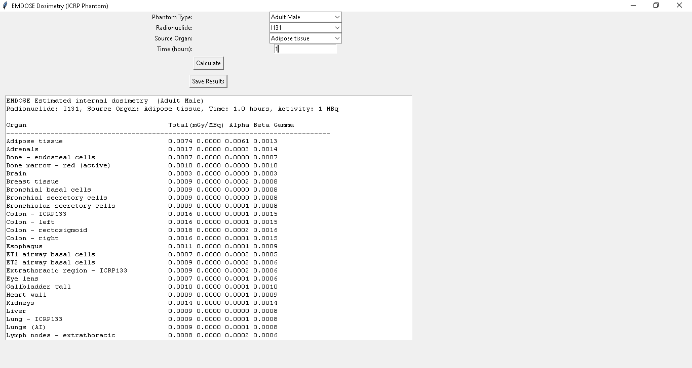
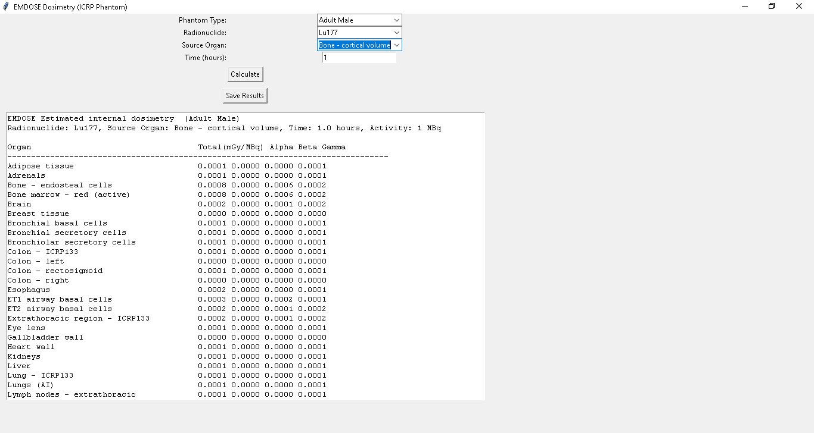
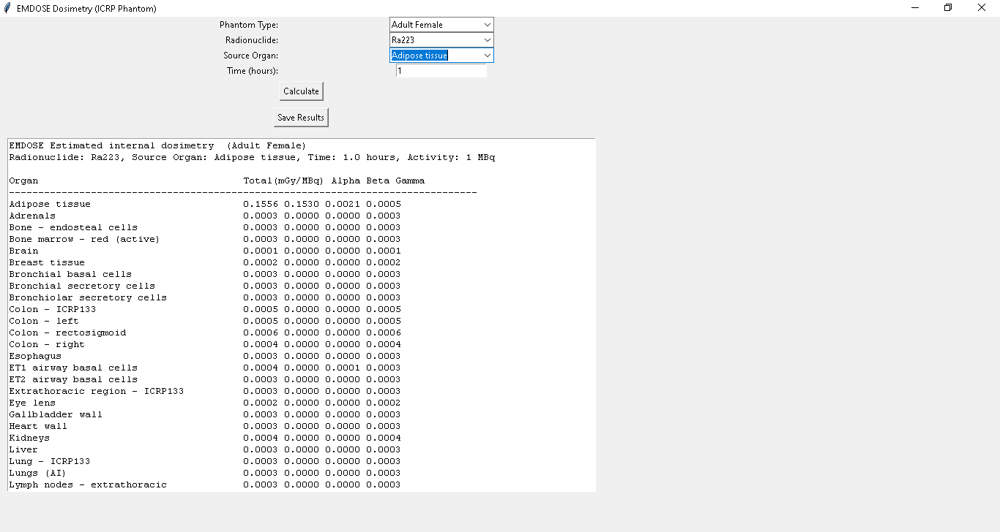

# EMDOSE_dosimetry
A GUI-based internal dose calculator using ICRP phantoms and S-value datasets. Supports adult male and female models for I-131, Lu-177, and Ra-223.
# EMDOSE - Internal Dose Calculator

**EMDOSE** is a standalone GUI application developed to calculate internal radiation dose based on radionuclide distribution in human organs. It uses standardized S-value datasets and ICRP reference phantoms (Adult Male / Adult Female) to estimate absorbed dose delivered to each organ due to alpha, beta, and gamma emissions.

The application supports the following radionuclides:
- Iodine-131 (I-131)
- Lutetium-177 (Lu-177)
- Radium-223 (Ra-223)

### ✨ Key Features
- Graphical user interface (Tkinter-based)
- Choose between Adult Male (`am_`) and Adult Female (`af_`) phantoms
- Organ-specific dose breakdown (alpha, beta, gamma)
- Data source compatibility with MIRDcalc and ICRP reference datasets
- Export results to `.txt` or `.pdf`
- Built-in support for clinical or research use

---

### 📦 Technologies
- Python (Tkinter)
- PyInstaller (for EXE generation)
- JSON-based S-value & self-dose matrices
- Optional PDF export via FPDF

---
## ⚠️ Important Notice for Running the EXE

Make sure to place the executable file (`EMDOSE.exe`) **in the same folder** as all the required JSON data files (e.g., `am_i131svalue_alpha.json`, `af_i131svalue_alpha.json`, etc.).

If the JSON files are not in the same directory as the EXE, the application **will not be able to find the necessary data** and will fail to run properly.

**Always keep the EXE and JSON files together in one folder!**
## Requirements

This application requires the following to be installed on your system:

### Python

- Python **3.8** or higher  
  [https://www.python.org/downloads/](https://www.python.org/downloads/)

### Python Libraries
- Python 3.8 or higher

- Standard Python libraries used (no extra install needed):
  - tkinter (usually comes with Python)
  - json
  - numpy
  - pandas
  - pyinstaller
- External libraries (install via pip):
  - fpdf (for PDF export)
  
```bash
pip install fpdf
pyinstaller --onefile --noconsole --name EMDOSE --icon=emdose.ico emdose.py
```
## 🖼️ Screenshot

Here is a screenshot of the EMDOSE application interface:




### 📜 License
This project is licensed under the MIT License – see the [LICENSE](LICENSE) file for details.
